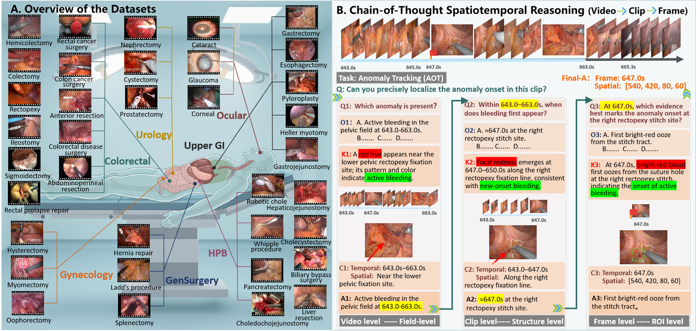
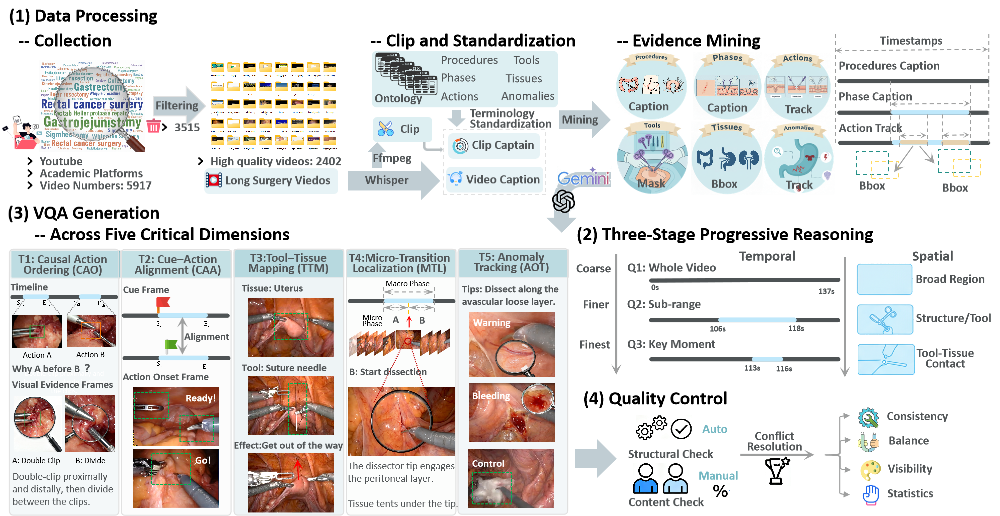
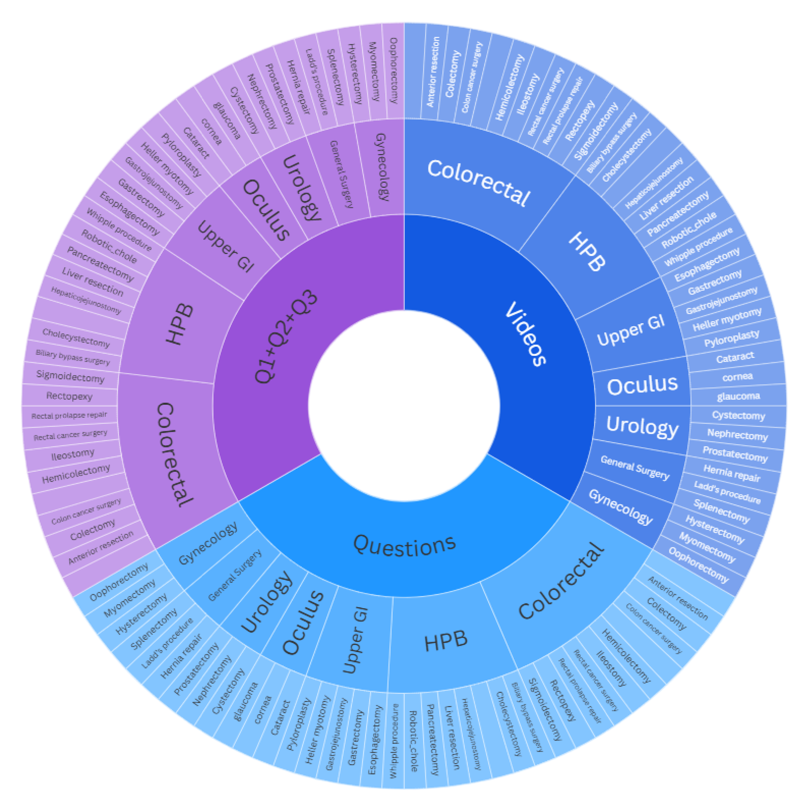
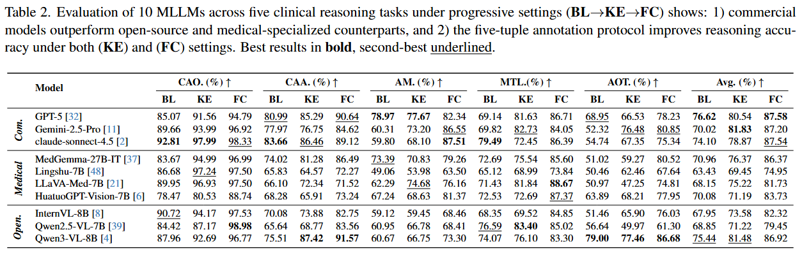
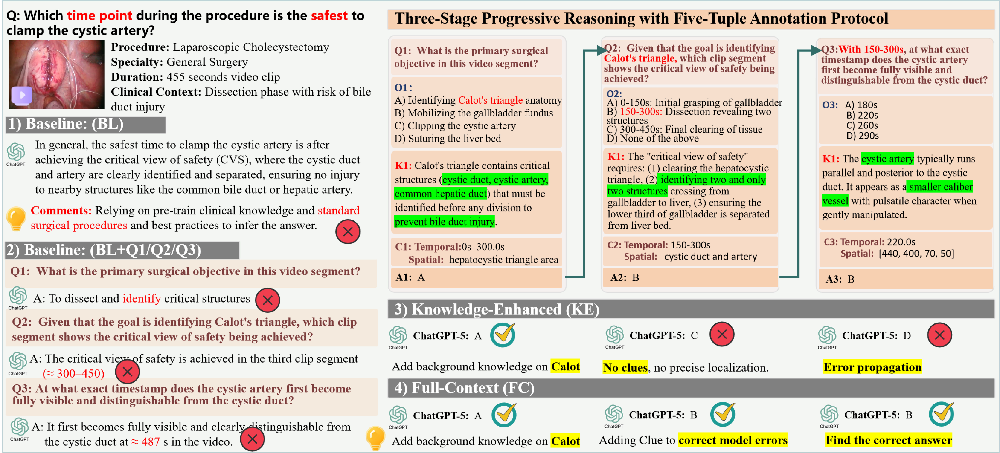

# SurgCoT: Advancing Spatiotemporal Reasoning in Surgical Videos through a Chain-of-Thought Benchmark

<div align="center">

[](https://arxiv.org/abs/2604.20319)
[](https://huggingface.co/datasets/wanggui/SurgCoT)
[](https://arxiv.org/abs/2604.20319)
[]()
[]()

</div>

## 🧑‍⚕️ Overview

**SurgCoT** is a surgical video benchmark for evaluating **Chain-of-Thought (CoT) reasoning** in Multimodal Large Language Models (MLLMs).

Fine-grained surgical understanding requires more than recognizing tools, surgical phases, or isolated frames. Surgeons need to reason over dynamic spatiotemporal evidence, track subtle procedural changes, identify causal action order, localize micro-transitions, and detect abnormal events. SurgCoT is designed to evaluate whether current MLLMs can perform this type of expert-level progressive reasoning in surgical videos.

SurgCoT contains **2,841 surgical videos** across **7 surgical specialties** and **35 procedures**, with **19,345 main questions** and **59,177 sub-questions**. It introduces a **three-stage progressive reasoning framework** and a **five-tuple annotation protocol**:

```text
Question → Option → Knowledge → Clue → Answer
```

<p align="center">
  
</p>

## 🔥 News

- **[2026-04-xx]** SurgCoT paper is available on [arXiv](https://arxiv.org/abs/2604.20319).
- **[2026-xx-xx]** SurgCoT has been accepted by **CVPR 2026**.
- **[2026-xx-xx]** SurgCoT dataset is released on [Hugging Face](https://huggingface.co/datasets/wanggui/SurgCoT).
- **[2026-xx-xx]** Evaluation code will be released soon.
- **[2026-xx-xx]** Benchmark leaderboard will be updated soon.

## 📌 Highlights

- **Large-scale surgical video benchmark**  
  SurgCoT includes **2,841 surgical videos**, **19,345 main questions**, and **59,177 sub-questions**.

- **Cross-specialty procedural coverage**  
  The benchmark covers **7 surgical specialties** and **35 procedures**, spanning abdominal, pelvic, and ophthalmic surgeries.

- **Chain-of-thought surgical reasoning**  
  SurgCoT evaluates progressive reasoning from video-level comprehension to clip-level analysis and frame-/patch-level localization.

- **Five-tuple annotation protocol**  
  Each sample is annotated with **Question**, **Option**, **Knowledge**, **Clue**, and **Answer**, supporting transparent and verifiable reasoning.

- **Fine-grained spatiotemporal grounding**  
  SurgCoT provides temporal windows, spatial clues, bounding boxes, masks, and event tracks for evidence-grounded reasoning.

- **Comprehensive MLLM evaluation**  
  SurgCoT evaluates commercial, open-source, and medical-specialized MLLMs under baseline, knowledge-enhanced, and full-context settings.

## 🏗️ Benchmark Construction

SurgCoT is constructed through a systematic pipeline with expert oversight, including surgical video collection, clip standardization, evidence mining, progressive reasoning design, VQA generation, and quality control.

<p align="center">
  
</p>

The construction pipeline contains four major stages:

1. **Data Processing**: multi-source video collection, clip segmentation, ASR alignment, ontology-driven terminology normalization, and evidence mining.
2. **Three-Stage Progressive Reasoning**: hierarchical reasoning from video-level comprehension to clip-level analysis and frame-/patch-level localization.
3. **VQA Generation**: structured task templates and ontology-driven design for generating surgical CoT questions.
4. **Quality Control**: dual-pass validation, structural checks, clinical consistency verification, and expert adjudication.

## 🧩 Benchmark Design

### 1. Three-Stage Progressive Reasoning

SurgCoT decomposes surgical reasoning into three hierarchical stages:

| Stage | Level | Goal |
|---|---|---|
| Q1 | Video-level comprehension | Identify whether a target surgical event or phenomenon occurs |
| Q2 | Clip-level analysis | Localize when and where the target event occurs |
| Q3 | Frame-/patch-level localization | Identify the exact onset frame and fine-grained anatomical or spatial region |

The reasoning chain progressively narrows the scope:

```text
Full video → Relevant clip → Key frame / spatial region
```

This design mirrors the way clinicians first understand the global surgical context, then inspect a relevant temporal window, and finally localize the exact visual evidence.

### 2. Five-Tuple Annotation Protocol

Each reasoning stage follows a structured five-tuple format:

| Field | Description |
|---|---|
| Question | A clinically meaningful query aligned with the surgical workflow |
| Option | Candidate answers designed to disambiguate similar surgical phenomena |
| Knowledge | Clinical background knowledge and domain priors |
| Clue | Video-grounded spatiotemporal evidence, such as time windows, ROIs, landmarks, masks, boxes, or tracks |
| Answer | The final adjudicated answer |

The **Knowledge** field explains the clinical “why”, while the **Clue** field anchors the visual “where” and “when”. Together, they encourage models to reason before answering.

### 3. Five Surgical Reasoning Dimensions

SurgCoT evaluates five core spatiotemporal reasoning dimensions:

| Abbreviation | Reasoning Dimension | Description |
|---|---|---|
| CAO | Causal Action Ordering | Determines the causal order of surgical micro-actions |
| CAA | Cue-Action Alignment | Aligns pre-action cues with action initiation |
| AM | Affordance Mapping | Grounds tool-tissue interactions and their functional effects |
| MTL | Micro-Transition Localization | Localizes fine-grained transitions between surgical micro-phases |
| AOT | Anomaly Onset Tracking | Identifies the onset and trajectory of surgical anomalies |

Together, these dimensions evaluate both normal surgical workflow reasoning and abnormal event handling.

## 📊 Dataset Statistics

SurgCoT contains **2,841 surgical videos**, **19,345 main questions**, and **59,177 sub-questions** across **35 procedures** and **7 surgical specialties**.

<p align="center">
  
</p>

| Item | Number |
|---|---:|
| Surgical videos | 2,841 |
| Surgical specialties | 7 |
| Surgical procedures | 35 |
| Main questions | 19,345 |
| Sub-questions | 59,177 |
| Total QA pairs | 78,522 |

SurgCoT covers the following surgical specialties:

- Colorectal Surgery
- Urological Surgery
- Upper Gastrointestinal Surgery
- Ocular Surgery
- Gynecologic Surgery
- General Surgery
- Hepatobiliary-Pancreatic Surgery

## 📦 Dataset Download

The SurgCoT dataset is available at Hugging Face:

```text
https://huggingface.co/datasets/wanggui/SurgCoT
```

You can download the dataset using:

```bash
git lfs install
git clone https://huggingface.co/datasets/wanggui/SurgCoT
```

or with the Hugging Face `datasets` library:

```python
from datasets import load_dataset

dataset = load_dataset("wanggui/SurgCoT")
```

## 📁 Recommended Data Structure

After downloading the dataset, we recommend organizing the files as follows:

```text
SurgCoT/
├── videos/
│   ├── colorectal/
│   ├── urology/
│   ├── upper_gi/
│   ├── ocular/
│   ├── gynecology/
│   ├── general_surgery/
│   └── hpb/
├── annotations/
│   ├── train.json
│   ├── val.json
│   └── test.json
├── evidence/
│   ├── temporal_clues/
│   ├── spatial_clues/
│   ├── masks/
│   ├── boxes/
│   └── tracks/
└── README.md
```

## 🧪 Evaluation Protocol

SurgCoT evaluates MLLMs under three settings.

### Baseline Setting

The model receives only the surgical video and the main question.

```text
Video + Question → Answer
```

This setting evaluates end-to-end surgical reasoning without additional guidance.

### Knowledge-Enhanced Setting

The model receives additional clinical knowledge and answers progressive sub-questions.

```text
Video + Question + Knowledge → Q1 / Q2 / Q3 → Answer
```

This setting evaluates whether clinical knowledge improves progressive surgical reasoning.

### Full-Context Setting

The model receives both clinical knowledge and video-grounded spatiotemporal clues.

```text
Video + Question + Knowledge + Clue → Q1 / Q2 / Q3 → Answer
```

This setting evaluates whether explicit temporal and spatial evidence helps models produce more accurate and grounded reasoning.

## 🚀 Quick Start

### Installation

```bash
git clone https://github.com/CVI-SZU/SurgCoT.git
cd SurgCoT

conda create -n surgcot python=3.10
conda activate surgcot

pip install -r requirements.txt
```

### Run Evaluation

```bash
python evaluate.py \
    --data_path ./data/test.json \
    --video_root ./data/videos \
    --model_name your_model_name \
    --setting full_context \
    --output_path ./outputs/predictions.json
```

### Compute Metrics

```bash
python compute_metrics.py \
    --prediction_path ./outputs/predictions.json \
    --annotation_path ./data/test.json
```

## 📈 Benchmark Results

SurgCoT evaluates representative commercial, open-source, and medical-specialized MLLMs across five surgical reasoning tasks under progressive settings.

<p align="center">
  
</p>

### Main Findings

- Commercial MLLMs generally outperform open-source and medical-specialized models.
- Current MLLMs still show significant limitations in surgical Chain-of-Thought reasoning.
- Models may answer the final question correctly while making mistakes in intermediate reasoning steps.
- Knowledge-enhanced and full-context settings improve performance, showing the value of structured reasoning supervision.
- Fine-grained temporal and spatial clues are especially helpful for tasks requiring precise localization, such as **Micro-Transition Localization** and **Anomaly Onset Tracking**.

## 🔍 Case Study

SurgCoT shows how structured reasoning can progressively correct model predictions. The case study below illustrates how a baseline response can be decomposed into clinical sub-questions, improved with domain knowledge, and further refined using spatiotemporal clues.

<p align="center">
  
</p>

The progression from **Baseline (BL)** to **Knowledge-Enhanced (KE)** and **Full-Context (FC)** demonstrates that clinical knowledge and visual clues can help MLLMs produce more grounded and reliable surgical reasoning.

## 🏥 Clinical Relevance

SurgCoT is designed to move beyond frame-level recognition and evaluate reasoning abilities that are closer to real surgical workflows. It supports evaluation of:

- Temporal action ordering
- Tool-tissue interaction understanding
- Fine-grained transition localization
- Surgical anomaly detection
- Evidence-grounded decision reasoning

By providing structured CoT annotations and spatiotemporal evidence, SurgCoT offers a reproducible testbed for developing clinically reliable surgical MLLMs.

## 📚 Citation

If you find SurgCoT useful for your research, please consider citing our paper:

```bibtex
@inproceedings{wang2026surgcot,
  title={SurgCoT: Advancing Spatiotemporal Reasoning in Surgical Videos through a Chain-of-Thought Benchmark},
  author={Wang, Gui and Zhou, YongSong and Deng, Kaijun and Cheah, Wooi Ping and Qu, Rong and Ren, Jianfeng and Shen, Linlin},
  booktitle={Proceedings of the IEEE/CVF Conference on Computer Vision and Pattern Recognition},
  year={2026}
}
```

## 🙏 Acknowledgements

This work was supported by the National Natural Science Foundation of China, Ningbo Municipal Bureau of Science and Technology, Guangdong Provincial Key Laboratory, and the Intelligent Computing Center of Shenzhen University.

We thank all clinicians, annotators, and researchers who contributed to the construction and validation of SurgCoT.

## 📬 Contact

For questions or suggestions, please contact:

```text
jianfeng.ren@nottingham.edu.cn
llshen@szu.edu.cn
```

or open an issue in this repository.

## 📄 License

The dataset is released for academic research purposes only.  
Please refer to the dataset license and usage agreement before using SurgCoT.
